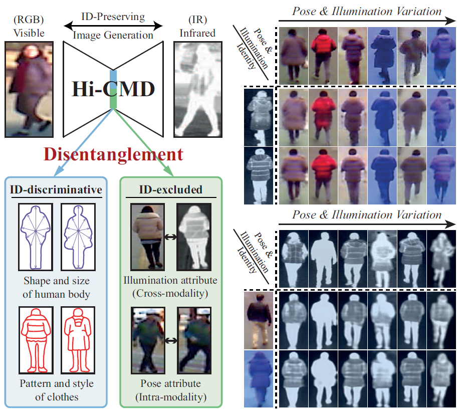

**I am currently studying as a visiting researcher at Carnegie Mellon University. So please email me if you are interested in collaborative research among those interested in re-identification in Pittsburgh or another city in the United States. Feel free to visit my [homepage](https://sites.google.com/site/seokeonchoi/) and [awesome person re-id github page](https://github.com/bismex/Awesome-person-re-identification)**

---

# Hi-CMD: Hierarchical Cross-Modality Disentanglement for Visible-Infrared Person Re-Identification

<**Illustration of our Hierarchical Cross-Modality Disentanglement (Hi-CMD) concept**>




## Prerequisites
- Ubuntu 18.04
- Python 3.6
- PyTorch 1.0+ (recent version is recommended)
- NVIDIA GPU (>= 8.5GB)
- CUDA 10.0 (optional)
- CUDNN 7.5 (optional)


## Getting Started
### Installation

- Configure virtual (anaconda) environment

```bash
conda create -n env_name python=3.6
source activate env_name
conda install pytorch torchvision cudatoolkit=10.0 -c pytorch
```

- Install python libraries

```bash
conda install -c conda-forge matplotlib
conda install -c anaconda yaml
conda install -c anaconda pyyaml 
conda install -c anaconda scipy
conda install -c anaconda pandas 
conda install -c anaconda scikit-learn 
conda install -c conda-forge opencv
conda install -c anaconda seaborn
conda install -c conda-forge tqdm
```

- Install ["Pretrained models for Pytorch"](https://github.com/Cadene/pretrained-models.pytorch)
  - To use pretrained models
```bash
git clone https://github.com/Cadene/pretrained-models.pytorch.git
cd pretrained-models.pytorch
python setup.py install
```

- Clone this repo:
  - [download](https://drive.google.com/uc?authuser=0&id=1JC2bgBbS98igWksSLQUWKDUqsPEHKjcK&export=download)

---

## Training and testing

- In the actual experiment, a total of 10 experiment sets are used.
- Here is a simple example of running an experiment on only one set (RegDB-01).
- Download [RegDB_01](https://drive.google.com/uc?export=download&confirm=faH1&id=1jxs5mJntClyBWhiS9Rymw5-XKHIl7NJs) (for a simple test) 
  - The RegDB_01 dataset should be included in './data/'
  - Ex: `./HiCMD/data/RegDB_01/`

### Training

```bash
sh train.sh
```

### Testing on pretrained model

#### 1) RegDB_01

- Download [RegDB_pretrained](https://drive.google.com/uc?export=download&confirm=wHE1&id=1hJBhymCTiK6bBcL7aiXdW-OnLJ6Rufas)
  - The pretrained RegDB_01 model should be included in './pretrained/'
  - Ex: `./HiCMD/pretrained/checkpoints/`

```bash
sh test.sh
```

- The code provides the following results.

| Metric    | Value  |
| ---    | ---  |
| Rank1 | 70.44\% |
| Rank5 | 79.37\% |
| Rank10 | 85.15\% |
| Rank20 | 91.55\% |
| mAP | 65.93\% |

- **Note that the performance of the manuscript (Rank1: 70.93\%) is obtained by averaging this experiment for all 10 sets.**
- If the code is not working, please refer to './pretrained/test_results/net_70000_RegDB_01_(ms1.0)_f1_test_result.txt'

#### 2) SYSU-MM01

- MATLAB is required for evaluating SYSU-MM01 (official code).
- Download [SYSU_features](https://drive.google.com/uc?export=download&confirm=hFnU&id=1qLb25dqiXGd_K5XvX8_28ee-tWrBuuto)
  - The pretrained SYSU-MM01 features should be included in './eval_SYSU/'
  - Ex: `./HiCMD/eval_SYSU/`


- The code provides the following results.

| Metric    | Value  |
| ---    | ---  |
| Rank1 | 34.94\% |
| Rank5 | 65.48\% |
| Rank10 | 77.58\% |
| Rank20 | 88.38\% |
| mAP | 35.94\% |

- If the code is not working, please refer to './eval_SYSU/results_test_SYSU.txt'

---


### (Optional) If all the files can not downloaded in the above links, please check the below links.

- [HiCMD-master.zip](https://drive.google.com/open?id=1JC2bgBbS98igWksSLQUWKDUqsPEHKjcK)
- [RegDB_01](https://drive.google.com/open?id=1jxs5mJntClyBWhiS9Rymw5-XKHIl7NJs) 
- [RegDB_pretrained](https://drive.google.com/open?id=1hJBhymCTiK6bBcL7aiXdW-OnLJ6Rufas)
- [SYSU_features](https://drive.google.com/open?id=1qLb25dqiXGd_K5XvX8_28ee-tWrBuuto)

### (Optional) Additional experiments

- If you want to experiment with all sets of RegDB, download the official dataset:
  - The RegDB dataset [1] can be downloaded from this [website](http://dm.dongguk.edu/link.html) by submitting a copyright form. (Named: "Dongguk Body-based Person Recognition Database (DBPerson-Recog-DB1)" on their website).

- If you want to experiment with SYSU-MM01, download the official dataset:
  - The SYSU-MM01 dataset [2] can be downloaded from this [website](http://www.sysu.edu.cn/403.html).
  - The authors' official [matlab code](https://github.com/wuancong/SYSU-MM01) is used to evaluate the SYSU dataset.

- Change the 'data_name' from 'RegDB_01' to the name of other datasets.
- Process the downloaded data according to the code by `python prepare.py`.
- Train and test 


## Acknowledgement

The code is based on the PyTorch implementation of the [Person_reID_baseline_pytorch](https://github.com/layumi/Person_reID_baseline_pytorch), [Cross-Model-Re-ID-baseline](https://github.com/mangye16/Cross-Modal-Re-ID-baseline), [MUNIT](https://github.com/NVlabs/MUNIT), [DGNET](https://github.com/NVlabs/DG-Net), [SYSU-evaluation](https://github.com/wuancong/SYSU-MM01).


## Citation
```
@InProceedings{Choi_2020_CVPR,
author = {Choi, Seokeon and Lee, Sumin and Kim, Youngeun and Kim, Taekyung and Kim, Changick},
title = {Hi-CMD: Hierarchical Cross-Modality Disentanglement for Visible-Infrared Person Re-Identification},
booktitle = {The IEEE Conference on Computer Vision and Pattern Recognition (CVPR)},
month = {June},
year = {2020}
}
```


## Reference


- [1] D. T. Nguyen, H. G. Hong, K. W. Kim, and K. R. Park. Person recognition system based on a combination of body images from visible light and thermal cameras. Sensors, 17(3):605, 2017.

- [2] A. Wu, W.-s. Zheng, H.-X. Yu, S. Gong, and J. Lai. Rgb-infrared crossmodality person re-identification. In IEEE International Conference on Computer Vision (ICCV), pages 5380–5389, 2017.
